# Architecture

### Google Architecture

Hypertable is a massively scalable database modeled after Google's Bigtable database. Bigtable is part of a group of scalable computing technologies developed by Google which is depicted in the following diagram.

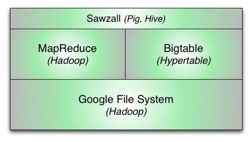

**Google File System (GFS)** \- This is the lowest layer of the Google scalable computing stack. It is a filesystem much like any other and allows for the creation of files and directories. The primary innovation of the Google filesystem is that it is massively scalable and highly available. It achieves high availability by replicating file data across three physical machines which means that it can lose up to two of the machines holding replicas and the data is still available. [Hadoop](http://hadoop.apache.org/) provides an open source implementation of the GFS called HDFS.

**MapReduce** \- This is a parallel computation framework designed to efficiently process data in the GFS. It provides a way to run a large amount of data through a piece of code (map) in parallel by pushing the code out to the machines where the data resides. It also includes a final aggregation step (reduce) which provides a way to re-order the data based on any arbitrary field. Hadoop provides an open source implementation of MapReduce.

**Bigtable** \- This is Google's scalable database. It provides a way to create massive tables of information indexed by a primary key. As of this writing, over 90% of Google's web services are built on top of Bigtable, including Search, Google Earth, Google Analytics, Google Maps, Gmail, Orkut, YouTube, and many more. Hypertable is a high performance, open source implementation of Bigtable.

**Sawzall** \- This is a runtime scripting language that sits on top of the whole stack and provides the ability to perform statistical analysis in an easily expressible way over large data sets. Open source projects such as Hive and Pig provide similar functionality.

### Hypertable System Overview

The diagram below provides a high-level overview of the Hypertable system followed by a brief description of each system component.

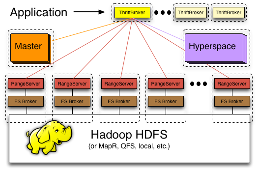

**Hyperspace** \- This is Hypertable's equivalent to Google's [Chubby](http://research.google.com/archive/chubby-osdi06.pdf) service. Hyperspace is a highly available lock manager and provides a filesystem for storing small amounts of metadata. Exclusive or shared locks may be obtained on any created file or directory. High availability is achieved by running in a distributed configuration with replicas running on different physical machines. Consistency is achieved through a distributed consensus protocol. Google refers to Chubby as, "the root of all distributed data structures" which is a good way to think of this system.

**Master** \- The master handles all meta operations such as creating and deleting tables. Client data does not move through the Master, so the Master can be down for short periods of time without clients being aware. The master is also responsible for detecting range server failures and re-assigning ranges if necessary. The master is also responsible for range server load balancing. Currently there is a single Master process, but high availability is achieved through hot standbys.

**Range Server** \- Range servers are responsible for managing ranges of table data, handling all reading and writing of data. They can manage up to potentially thousands of ranges and are agnostic to the set of ranges that they manage or the tables of which they're a part. Ranges can move freely from one range server to another, an operation that is mostly orchestrated by the Master.

**FS Broker** \- Hypertable is capable of running on top of any filesystem. To achieve this, the system has abstracted the interface to the filesystem by sending all filesystem requests through a File System (FS) broker process. The FS broker provides a normalized filesystem interface and translates normalized filesystem requests into native filesystem requests and vice-versa. FS brokers have been developed for [HDFS](https://hadoop.apache.org/docs/stable/hadoop-project-dist/hadoop-hdfs/HdfsDesign.html), [Ceph](http://ceph.newdream.net/), [KFS](http://code.google.com/p/kosmosfs/), and local (for running on top of a local filesystem).

**ThriftBroker** \- Provides an interface for applications written in any high-level language to communicate with Hypertable. The ThriftBroker is implemented with [Apache Thrift](https://thrift.apache.org/) and provides bindings for applications written in Java, PHP, Ruby, Python, Perl, and C++.

### Data Representation

Like a relational database, Hypertable represents data as tables of information. Each row in a table has cells containing related information, and each cell is identified, in part, by a row key and column name. Support for up to 255 column names is provided when the table is created. Hypertable provides two additional features:

  * column qualifier - The column names defined in the table schema are referred to as column families. Applications may supply an optional column qualifier, with each distinct qualifier representing a qualified column instance belonging to the column family . The application can define an unlimited number of qualified instances of a column family. The application supplied column name has the format _family:qualifier_ , and column data is stored in a sparse format such that one row may have millions of qualified instances of a column family, while another row may have none or just a few instances.

  * timestamp - This is a 64-bit field associated with each cell that allows for different cell versions. The value represents nanoseconds since the [Unix epoch](http://en.wikipedia.org/wiki/Unix_time) and can be supplied by the application or auto-assigned by the server. The number of versions stored can be configured in the table schema and the number of versions returned can be specified in the query predicate. The versions are stored in reverse-chronological order, so that the newest version of the cell is returned first.

The following diagram illustrates how data is represented in Hypertable. The table is an example taken from a web crawler that stores information for each page that it crawls in a row of the table.

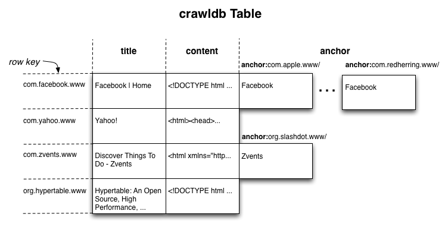

The above diagram illustrates the use of the column qualifier. A Web search engine builds an index (much like the one in the back of a book) that points words to the Web documents that contain them. Included in this index are not only the words included in the Web page, but also words included in the anchor text of the remote links that point to the Web page. This is how image results can appear in Web search results. For example, given an image of a Ferrari (which contains no text), if there are enough links pointing to the image that contain the word "Ferrari" in the anchor text, then the page may get a high score for the query "Ferrari" and appear in the search results.

The one dimension that is missing from the above diagram is the timestamp. Imagine that each cell in the diagram above has a z-axis that contains timestamped versions of the cell. This multi-dimensional table gets flattened out, under the hood, as sorted lists of key/value pairs as illustrated in the following diagram.

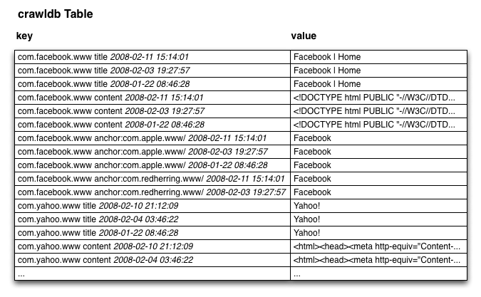

### Anatomy of a Key

The following diagram illustrates the format of the key that Hypertable uses internally.
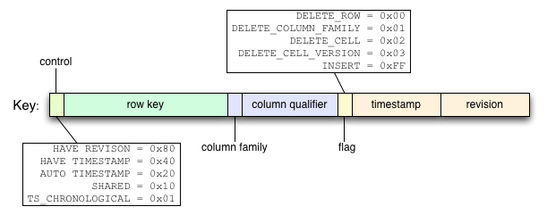

  * **control** \- This field is consists of bit flags that describe the format of the remaining fields. There are certain circumstances where the timestamp or revision number may be absent, or where they are identical, in which case, they're collapsed into a single field. This field contains that information and tells Hypertable how to properly interpret the key.
  * **row key** \- This field contains a '\0' terminated string that represents the row key.
  * **column family** \- This field is a single-byte field that indicates the column family code.
  * **column qualifier** \- This field contains a '\0' terminated string that represents the column qualifier.
  * **flag** \- Deletes are handled through the insertion of special "delete" records (or tombstones) that indicate that some portion of a row's cells have been deleted. These delete records are applied at query time and the deleted cells are garbage collected during major compactions.
  * **timestamp** \- This field is an 8-byte (64-bit) field that contains the cell timestamp, represented as nanoseconds since the Unix epoch. By default, the timestamp is stored big-endian, ones-compliment so that within a given cell, versions are stored newest to oldest.
  * **revision** \- This field is an 8-byte (64-bit) field that contains a high resolution timestamp that currently is used internally to provide snapshot isolation for queries.

### Access Groups

Access Groups provide a way to control the physical storage of column data to optimize disk I/O. Access Groups are defined in the table schema and instruct Hypertable to physically store all data for columns within the same access group together on disk. This feature allows you optimize queries for columns that are accessed with high frequency by reducing the amount of data transferred from disk during query execution. Disk I/O is limited to just the data from the access groups of the columns specified in the query. For example, consider the following schema.

    CREATE TABLE User (
      name,
      address,
      photo,
      profile,
      ACCESS GROUP default (name, address, photo),
      ACCESS GROUP profile (profile)
    );

Hypertable will create two physical groupings of column data, one for the _name_ , _address_ , and _photo_ columns, and another for the _profile_ column. The following diagram illustrates this physical grouping.

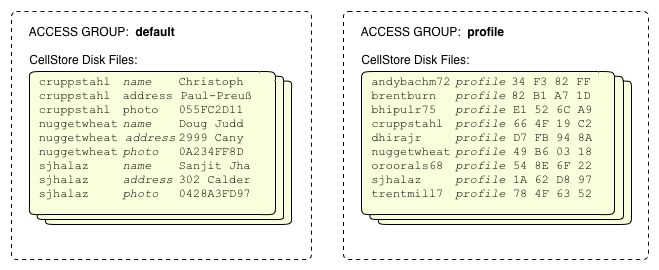

Consider the following query for the _profile_ column of the User table.

    SELECT profile from User;

The execution of this query will be efficient because only the data for the _profile_ column will be transferred from disk during query execution.

### RangeServer Insert Handling

The following diagram illustrates how inserts are handled inside the RangeServer.

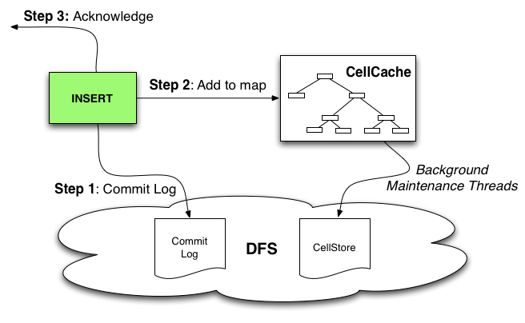

  * **Step 1: Commit Log** \- Inserts are appended to the Commit log which resides in the distributed filesystem (DFS) and followed by a _sync_ operations that tells the filesystem to persist any buffered writes to disk. If multiple insert requests are pending, or a GROUP_COMMIT_INTERVAL is configured for the table, then the sync operation is performed after multiple Commit log appends to improve throughput.
  * **Step 2: Add to map** \- The inserts are added to the in-memory CellCache (equivalent to the Memtable in the Bigtable paper).
  * **Step 3: Acknowledge** \- Acknowledgement is sent back to the application.
  * **Background Maintenance Threads** \- Over time, as the CellCaches fill memory, background maintenance threads will "spill" the in-memory CellCache data to on-disk CellStore files which frees up memory inside the RangeServer which allows it to accept more inserts.

This design makes Hypertable writes durable and consistent because inserts are not acknowledged until the Commit log has been successfully written to.

### RangeServer Query Handling

The following diagram illustrates how queries are handled inside the RangeServer.

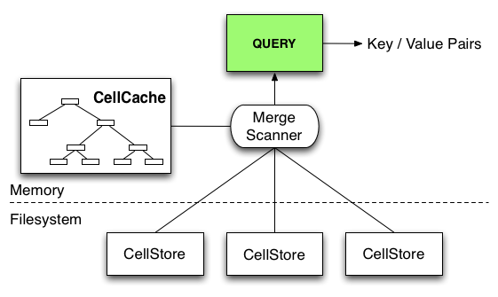

Data for a range can reside in the in-memory CellCache as well as in some number of on-disk CellStores (see following section). To evaluate a query over a table range, the RangeServer must create a unified view of the data, which it does through the use of a MergeScanner object, which merges together the sorted key/value pairs coming from the CellCache and CellStores. This unified stream of key/value pairs is then filtered to produce the desired results.

### CellStore Format

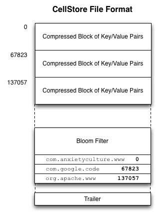Over time, the RangeServers will write in-memory CellCaches to on-disk files, called CellStores, whose format is illustrated in the illustration to the right. The following describes the sections of the CellStore file format.

  * **Compressed blocks of cells (key/value pairs)** \- This section consists of a series of sorted blocks of compressed sorted key/value pairs. By default, the compressed blocks are approximately 64KB in size. This size can be controlled by the Hypertable.RangeServer.CellStore.
DefaultBlockSize property. These blocks are the minimum unit of data transfer from disk.
  * **Bloom Filter** \- After the compressed blocks of key/value pairs comes the bloom filter. This is a probabalistic data structure that describes the keys that exist (with high likelihood) in the CellStore. It also signals if a key is definitively not present, which helps the RangeServer avoid unnecessary block transfer and decompression.
  * **Block Index** \- After the bloom filter comes the block index. This index lists, for each block, the last key in the block followed by the block offset.
  * **Trailer** \- At the end of the CellStore is the trailer. The trailer contains general statistics about the CellStore and includes the version number of the CellStore format so that the RangeServer can interpret it correctly.

### Query Routing

The following diagram illustrates the data structures that support the query routing algorithm which is how queries get sent to the relevant RangeServers.

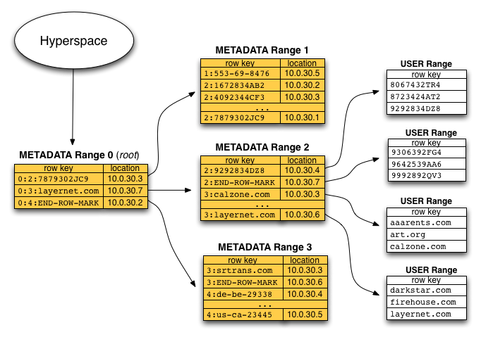

####  METADATA Table

There exists a special table in Hypertable called the METADATA table that contains a row for each range in the system. There is a column _Location_ , that indicates which RangeServer is currently serving the range. Though the diagram shows IP addresses in the Location column, the system stores a proxy name for the RangeServer in that column so that the system can be run on public clouds such as Amazon's EC2 and operate correctly in the face of server restarts and IP address changes. A two-level hierarchy is overlaid on top of the METADATA table. The first range is the ROOT range which contains pointers to the second-level ranges which, in turn, contain pointers to the USER ranges, which are the ranges that make up regular user or application defined tables.

####  Client Library

The Client Library provides the application programming interface (API) that allows an application to talk to Hypertable. This library is linked into each Hypertable application and handles query routing. The client library includes a METADATA cache which contains the range location information obtained by walking the METADATA hierarchy. Most application range location requests are served directly out of this cache. The ThriftBroker, which provides a high-level language interface to Hypertable, links against the client library and is a long-lived process, so its METADATA cache is usually fresh and populated. For this reason, we recommend that short lived applications (e.g. CGI programs) use the Thrift interface to avoid having to walk the METADATA hierarchy for each request.

### Adaptive Memory Allocation

The following diagram illustrates how the RangeServer adapts its memory usage based on changes in workload.

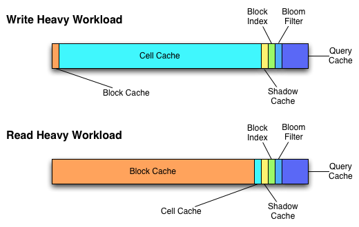

Under write-heavy workload, the RangeServer will give more memory to the CellCaches so that they can grow as large as possible, which minimizes the amount of spilling and merging work required. Under read-heavy workload, the system gives most of the memory to the block cache, which significantly improves query throughput and latency.
