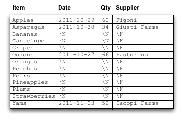
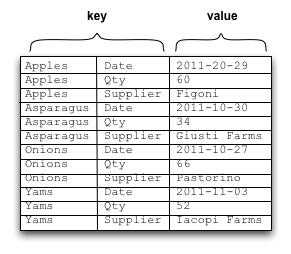
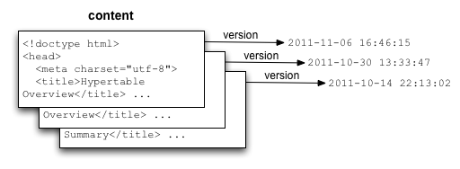
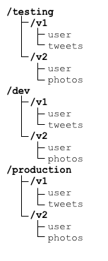
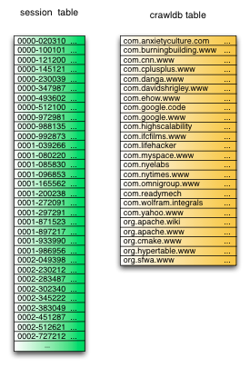
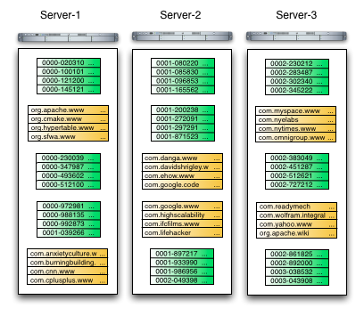
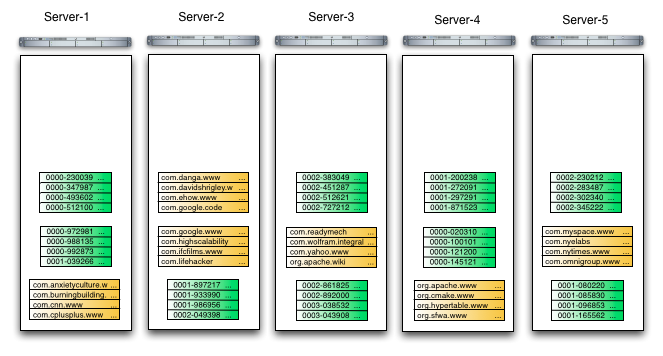

# Overview

Hypertable is a high performance, open source, massively scalable database modeled after Bigtable, Google's proprietary, massively scalable database. This page provides a brief overview of Hypertable, comparing it with a relational database, highlighting some of its unique features, and illustrating how it scales.

### Comparison to a Relational Database

Hypertable is similar to a relational database in that it represents data as tables of information, with rows and columns, but that's about as far as the analogy goes. The following is a list of some of the main differences

  * Row keys are UTF-8 strings
  * No support for data types, values are treated as opaque byte sequences
  * No support for joins
  * No support for transactions

Tables in Hypertable can be thought of as massive tables of data, sorted by a single primary key, the row key.

### Physical Layout

A relational database assumes that each column defined in the table schema will have a value for each row that is present in the table. NULL values are usually represented with a special marker (e.g. \N). The primary key and column identifier are implicitly associated with each cell based on its physical position within the layout. The following diagram illustrates how a relational database table might be laid out on disk.

Hypertable (and Bigtable) takes its design from the [Log Structured Merge Tree](https://www.cs.umb.edu/~poneil/lsmtree.pdf). It flattens out the table structure into a sorted list of key/value pairs, each one representing a cell in the table. The key includes the full row and column identifier, which means each cell is provided complete addressing information. Cells that are NULL are simply not included in the list which makes this design particularly well-suited for sparse data. The following diagram illustrates how Hypertable stores table data on-disk.

Though there can be a fair amount of redundancy in the row keys and column identifiers, Hypertable employs key-prefix and block data compression which considerably mitigates this problem.

### Cell Versions

Hypertable extends the traditional two-dimensional table model by adding a third dimension: timestamp. This timestamp dimension can be thought of as representing different versions of each table cell, as illustrated in the following diagram.

When queried, the most recent cell version is returned first. By default, all cell versions are retained for each column, but the number of versions retained can be capped by specifying the MAX_VERSIONS option to the column specification in the CREATE TABLE statement. The timestamp can be supplied by the application at insert time, or can be auto-generated (default).

### Column Qualifiers

This feature provides a way for users to introduce sparse column data that can be easily selected with Hypertable Query Language (HQL) or any of the other query interfaces.

A column specification in the Hypertable CREATE TABLE statement actually defines a set of related columns known as a _column family_. Users may supply an optional column qualifier and specify the qualified column as family:qualifier. The qualifier is a NUL-terminated string. For example, if a column family _tag_ is specified in a CREATE TABLE statement, as shown below,

    CREATE TABLE Info (
      tag
    );

then qualified columns such as the following may be created/inserted into the table.

    tag:bigtable
    tag:nosql
    tag:bigdata

### Namespaces

Namespaces provide a way to logically group tables together and are analogous to the directory hierarchy in a modern filesystem. Namespaces allow you to organize your tables into related groups, keeping table names simple, as table names need only be unique within the namespace in which they are created. All Hypertable instances have a built-in default root namespace "/". The following diagram illustrates an example namespace hierarchy.

### How Scaling Works

This section illustrates how Hypertable scales. Let's say the system has been loaded with the following two tables, a session ID table and a crawl database table.

Over time, Hypertable will break these tables into ranges and distribute them to what are known as _RangeServer_ processes. These processes manage ranges of table data and run on all slave server machines in the cluster. For example, assuming there are three slave servers, the following diagram shows what the system might look like over time. As can be seen by the diagram, the three servers are filled to capacity.

Adding more capacity is a simple matter of adding new commodity class servers and starting RangeServer processes on the new machines. Hypertable will detect that there are new servers available with plenty of spare capacity and will automatically migrate ranges from the overloaded machines onto the new ones.

This range migration process has the effect of balancing load across the entire cluster and opening up additional capacity.
